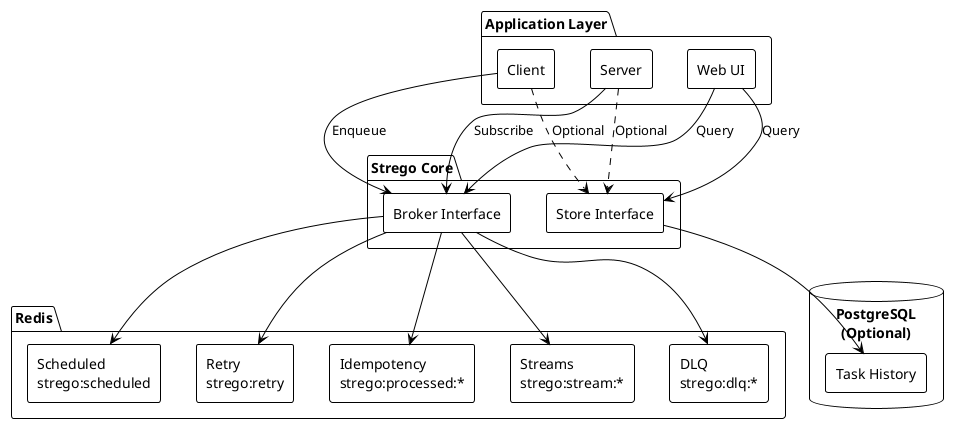
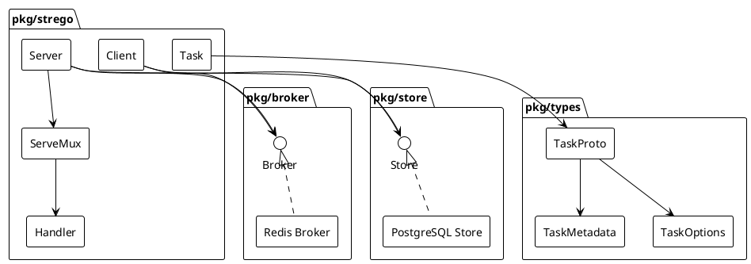
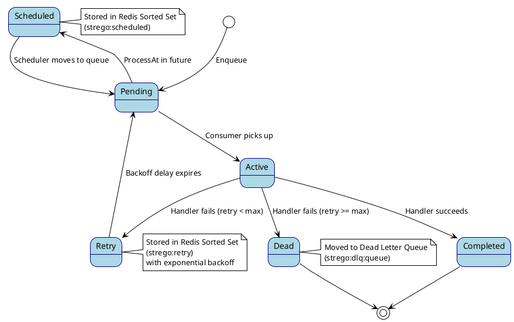
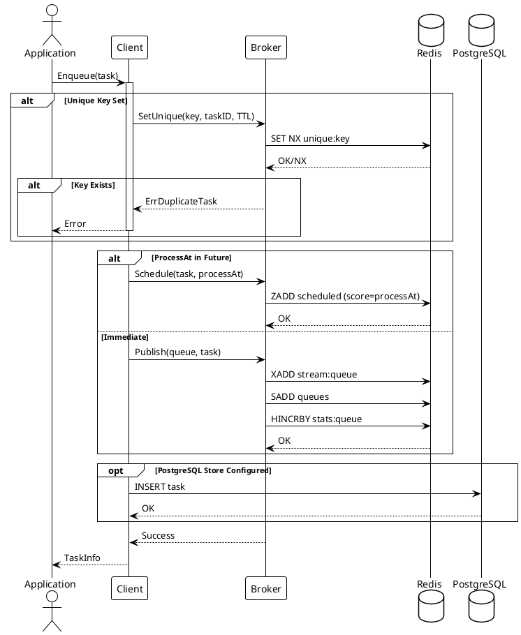
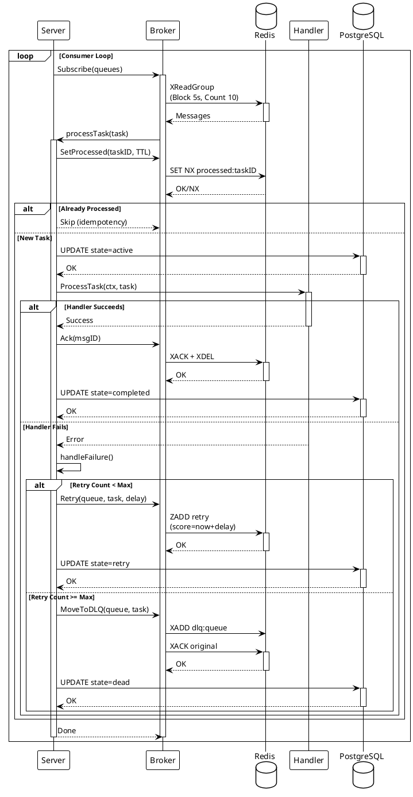
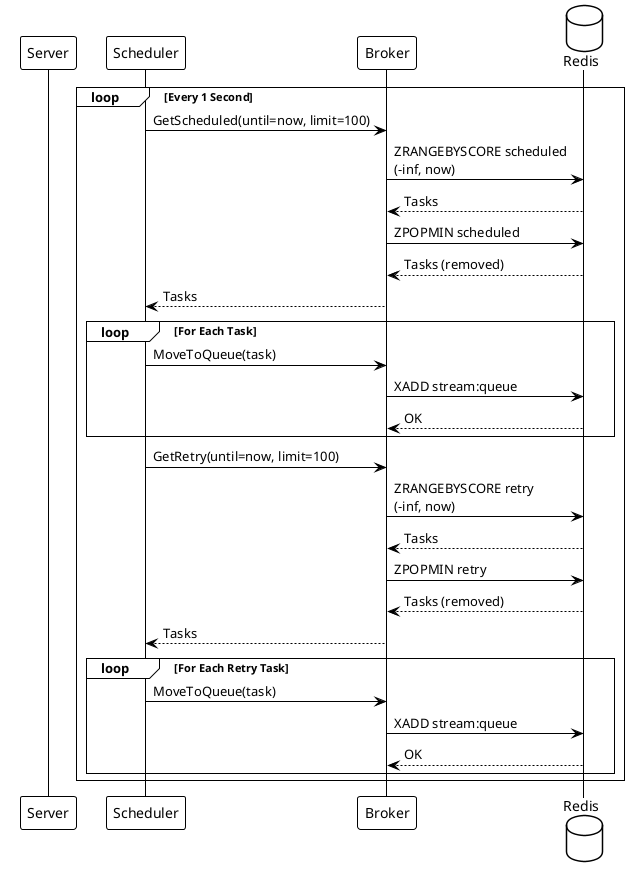
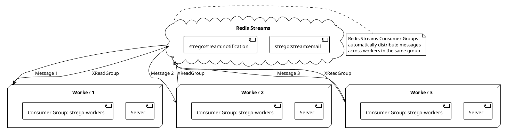
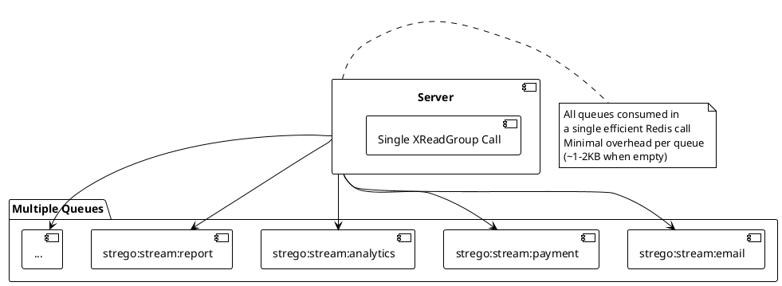

# Strego Architecture

This document describes the architecture and design of Strego, a distributed task queue library for Go.

## Table of Contents

- [System Overview](#system-overview)
- [Component Architecture](#component-architecture)
- [Task Lifecycle](#task-lifecycle)
- [Task Processing Flow](#task-processing-flow)
- [Redis Data Structures](#redis-data-structures)
- [Scaling & Performance](#scaling--performance)

## System Overview

Strego is built on top of Redis Streams and provides a production-ready task queue system with features like scheduled tasks, retries, dead letter queues, and exactly-once processing.



## Component Architecture



## Task Lifecycle

A task goes through several states during its lifecycle:



## Task Processing Flow

### Enqueue Flow



### Processing Flow



### Scheduler Flow



## Redis Data Structures

```plantuml
@startuml Redis Data Structures
!theme plain
skinparam componentStyle rectangle

package "Redis Keys" {
  component "strego:stream:{queue}" as Stream {
    note right: Redis Stream\nXADD, XREADGROUP
  }
  
  component "strego:dlq:{queue}" as DLQ {
    note right: Redis Stream\nDead Letter Queue
  }
  
  component "strego:scheduled" as Scheduled {
    note right: Sorted Set (ZSET)\nScore = Unix Timestamp
  }
  
  component "strego:retry" as Retry {
    note right: Sorted Set (ZSET)\nScore = Retry Time
  }
  
  component "strego:processed:{task_id}" as Processed {
    note right: String with TTL\nIdempotency Check
  }
  
  component "strego:unique:{key}" as Unique {
    note right: String with TTL\nDeduplication
  }
  
  component "strego:stats:{queue}" as Stats {
    note right: Hash\nQueue Statistics
  }
  
  component "strego:queues" as Queues {
    note right: Set\nAll Queue Names
  }
}

@enduml
```

## Scaling & Performance

### Horizontal Scaling



### Queue Isolation



## Key Design Decisions

1. **Redis Streams over Lists**: Native consumer groups, better crash recovery, built-in message tracking
2. **Protobuf Serialization**: Type-safe, efficient, language-agnostic
3. **Lazy Queue Creation**: Queues created on first use, no upfront cost
4. **Idempotency via SET NX**: Exactly-once processing guarantee
5. **Exponential Backoff**: Configurable retry strategy with max duration cap
6. **Optional PostgreSQL**: Redis is primary, PostgreSQL for history/search
7. **Single Consumer Group**: All workers in same group for load balancing

## Performance Characteristics

- **Queue Creation**: Lazy, ~1-2KB per empty queue
- **Batch Processing**: Configurable batch size (default: 10)
- **Blocking Reads**: Configurable timeout (default: 5s)
- **Horizontal Scaling**: Linear with number of workers
- **Memory Efficient**: Automatic cleanup of processed tasks
